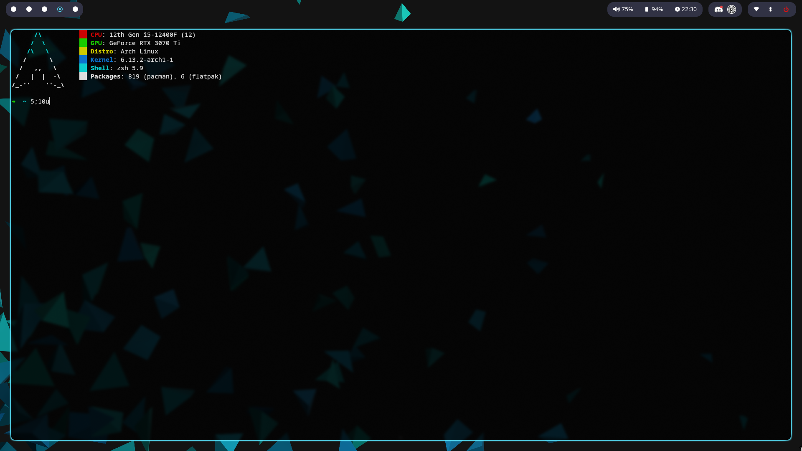

# .dotfiles

Este repositório contém a minha configuração pessoal de ambiente no Linux. Ele é composto por diversos arquivos de configuração utilizados para personalizar meu terminal e outras ferramentas essenciais para a produtividade. A configuração foi pensada para proporcionar um ambiente de trabalho eficiente e agradável.



## Ferramentas utilizadas

- **Hyprland**: Um compositor Wayland dinâmico e altamente configurável. Ele permite um controle completo sobre o ambiente gráfico e é projetado para ser rápido e eficiente. 

- **Waybar**: Um painel altamente configurável para o Wayland. Ele oferece uma aparência limpa e moderna, com a possibilidade de adicionar vários módulos para informações úteis, como o tempo, consumo de CPU, entre outros.
  
- **Neofetch**: Uma ferramenta simples e visualmente atrativa para mostrar informações sobre o sistema, como a distribuição Linux, versão do kernel, tempo de atividade, entre outros. É uma maneira de deixar o terminal mais interessante.

- **Kitty**: Um terminal gráfico rápido e altamente configurável, que suporta recursos como renderização GPU e suporte a múltiplas guias.

## Como usar

1. Clone este repositório em sua máquina:
   ```bash
   git clone https://github.com/gustavx404/.dotfiles.git
