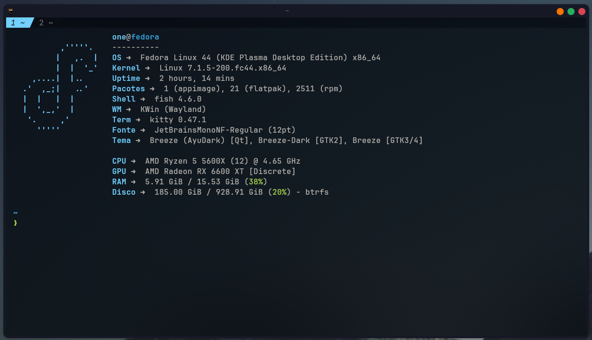

# Dotfiles

> Terminal Kitty · ZSH · Starship · zoxide · fzf · eza — tudo sob o tema **Ayu Dark** (azul como acento principal).

Suporte a **Fedora**, **Ubuntu** e **Arch** (instalador detecta a distro automaticamente).



---

## Stack

| Camada       | Ferramenta                          |
|--------------|-------------------------------------|
| Terminal     | [Kitty](https://sw.kovidgoyal.net/kitty/) 0.47+ |
| Shell        | [ZSH](https://www.zsh.org/) 5.9+ / Bash (fallback) |
| Prompt       | [Starship](https://starship.rs/) com palette Ayu Dark |
| cd inteligente | [zoxide](https://github.com/ajeetdsouza/zoxide) |
| Fuzzy finder | [fzf](https://github.com/junegunn/fzf) |
| `ls`         | [eza](https://github.com/eza-community/eza) |
| `cat`        | [bat](https://github.com/sharkdp/bat) |
| info         | [fastfetch](https://github.com/fastfetch-cli/fastfetch) |
| Fonte        | JetBrainsMono Nerd Font |

**Paleta Ayu Dark** — `#0A0E14` fundo · `#73D0FF` azul (primária) · `#FFD173` amarelo · `#FF6767` vermelho · `#AAD84C` verde · `#F29E74` laranja-magenta · `#686868` cinza.

---

## Instalação rápida

```bash
# instala tudo (pacotes + symlinks + chsh)
curl -fsSL https://raw.githubusercontent.com/gustavx404/.dotfiles/main/scripts/install.sh | bash
```

Ou, com o repositório já clonado:

```bash
./scripts/install.sh            # instalar
./scripts/install.sh status     # verificar configurações
./scripts/install.sh backup     # backup das configs existentes
./scripts/install.sh uninstall  # remover symlinks (não desinstala pacotes)
```

O instalador:

1. Detecta a distro e instala via `dnf` / `apt` / `pacman`:
   `zsh zoxide fzf eza bat fastfetch git unzip curl` (pacote-a-pacote, pra não derrubar a transação quando um falta).
2. Instala **starship** via script oficial de `starship.rs` em `~/.local/bin` (não empacotado no dnf do Fedora 44).
3. Instala **JetBrainsMono Nerd Font** (download direto do GitHub).
4. Aplica todos os symlinks (`~/.zshrc`, `~/.bashrc`, `~/.gitconfig`, `~/.config/{kitty,shell,starship,fastfetch}`) e força reaponto de symlinks antigos/stale.
5. Roda `chsh -s /usr/bin/zsh` para tornar o zsh o shell padrão de login.

Verifique o status com `./scripts/install.sh status`. Se `/usr/bin/zsh` não for o login shell depois da primeira rodada, rode manualmente:

```bash
chsh -s /usr/bin/zsh
```

(necessário porque `chsh` altera o `/etc/passwd` — alguns ambientes só aplicam no login seguinte).

---

## Estrutura

```
dotfiles/
├── .config/
│   ├── kitty/
│   │   ├── kitty.conf         # config principal (inclui o tema)
│   │   └── current-theme.conf # paleta Ayu Dark (somente cores)
│   ├── starship/
│   │   └── starship.toml       # prompt com palette ayu_dark
│   ├── fastfetch/
│   │   └── config.jsonc        # info do sistema (azul como keyColor)
│   ├── shell/
│   │   ├── .zshrc              # zsh + starship/zoxide/fzf/eza
│   │   ├── .bashrc             # bash mirror
│   │   ├── aliases.sh          # aliases comuns (sourced por ambos)
│   │   ├── aliases.zsh         # extras zsh
│   │   └── aliases.bash       # extras bash
│   └── git/
│       └── .gitconfig          # git config com aliases
├── scripts/
│   └── install.sh              # instalador multi-distro
└── opencode.json               # config do opencode (ver seção abaixo)
```

> `~/.config/shell/` tem que existir antes de sourcear `aliases.sh` — o instalador cuida disso. Para clones manuais: `mkdir -p ~/.config/shell && ln -s .../.config/shell ~/.config/shell-dir` (o symlink aponta a pasta inteira).

---

## Kitty Terminal

Tema **Ayu Dark** carregado via `include current-theme.conf` (mantém cores separadas da config). Transparência 85% + blur 30.

### Atalhos de teclado (mão esquerda)

Todos usam `Alt` (mod1) para operar só com a mão esquerda.

| Atalho    | Ação                  |
|-----------|-----------------------|
| `Alt+A`   | Aba 1                 |
| `Alt+S`   | Aba 2                 |
| `Alt+D`   | Aba 3                 |
| `Alt+F`   | Aba 4                 |
| `Alt+W`   | Nova aba              |
| `Alt+Z`   | Fechar aba            |
| `Alt+Q/E` | Mover aba ↺ / ↻       |
| `Alt+X`   | Aba anterior          |
| `Alt+V/B` | Janela vizinha ← / →  |
| `Alt+J/K` | Split vertical / horizontal |
| `Alt+O`   | Limpar terminal       |

---

## Shell

- **Prompt**: Starship (cores da palette `ayu_dark` em `starship.toml`).
- **cd**: `zoxide` apelidado como `cd` (`z init --cmd cd`).
- **fzf**: cores Ayu em `FZF_DEFAULT_OPTS`, key-bindings carregados automaticamente.
- **eza**: substitui `ls` com ícones e git status.
- **bat**: substitui `cat` (quando disponível).
- **fastfetch**: roda automaticamente ao abrir o terminal (guardado por `LOADED_FF`).

### Aliases comuns (`aliases.sh` — sourceado por zsh e bash)

| Alias       | Comando                            |
|-------------|-----------------------------------|
| `.. … ….`   | `cd` um/dois/três níveis         |
| `ls/ll/la`  | listagem (com eza se disponível)  |
| `update`    | atualiza pacotes (dnf/apt/pacman) |
| `install`   | instala pacote                    |
| `g/gs/gl`   | atalhos git (`git s`, `git l`...) |
| `cat`       | `bat --style=plain`               |
| `psg`       | `ps aux \| grep`                  |
| `ports`     | portas em LISTEN                  |
| `reloadzsh` | `exec zsh`                        |

Diferentes aliases de `update/install/search` são escolhidos automaticamente conforme a distro (`/etc/os-release`).

---

## Git

Configuração com aliases úteis — editar `~/.config/git/.gitconfig`.

| Alias | Comando                       |
|-------|------------------------------|
| `git s`  | `status`                  |
| `git c`  | `commit`                  |
| `git p`  | `push`                    |
| `git l`  | `log --oneline --graph`   |
| `git a`  | `add`                     |
| `git d`  | `diff`                    |
| `git co` | `checkout`                |
| `git cb` | `checkout -b`             |
| `git br` | `branch`                  |
| `git last` | `log -1 HEAD`           |
| `git unstage` | `reset HEAD --`     |
| `git amend` | `commit --amend --no-edit` |

---

## opencode

Este repositório é usado também como fonte da configuração do [opencode](https://opencode.ai). Esse setup **não é parte das dotfiles de terminal** — vive no mesmo repo, mas é independente.

### Onde está

- `opencode.json` — modelo, permissões, plugins e MCP servers (context7 + ai-memory).
- `.opencode/skills/` — skills do opencode:
  - `dotfile-manager/SKILL.md` — ajudar a gerenciar os dotfiles.
  - `cross-platform/SKILL.md` — suporte a múltiplas distros.

### Como usar

As skills são carregadas automaticamente quando você inicia o opencode dentro deste repo (`.opencode/skills/`). O `opencode.json` no diretório do projeto sobrescreve qualquer `~/.config/opencode/opencode.json`.

> Para isolar totalmente do prompt do terminal, considere mover para um repositório separado ainda que isso quebre o one-liner de instalação — atualmente elas coabitam por conveniência.

---

## Detalhes da máquina de referência

- **CPU**: AMD Ryzen 5 5600X (12) @ 4.65 GHz
- **GPU**: AMD Radeon RX 6600 XT
- **RAM**: 16 GB
- **Storage**: 1TB NVMe (btrfs)
- **WM**: KDE Plasma (Wayland)
- **Kernel**: Fedora 44

Visualize o sistema no terminal:

```bash
fastfetch
```
